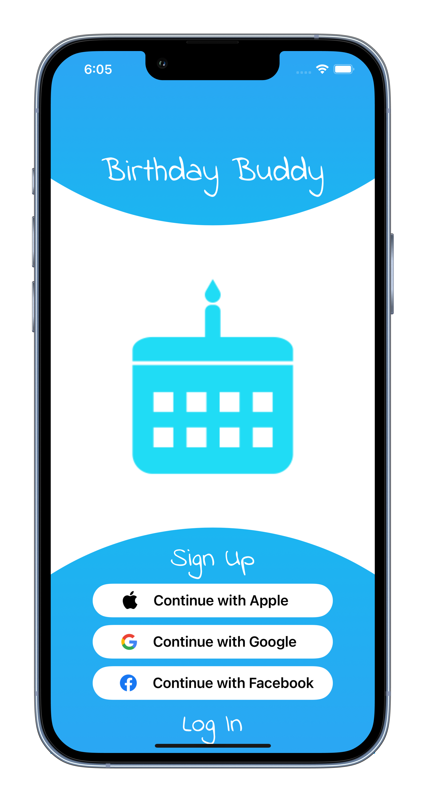
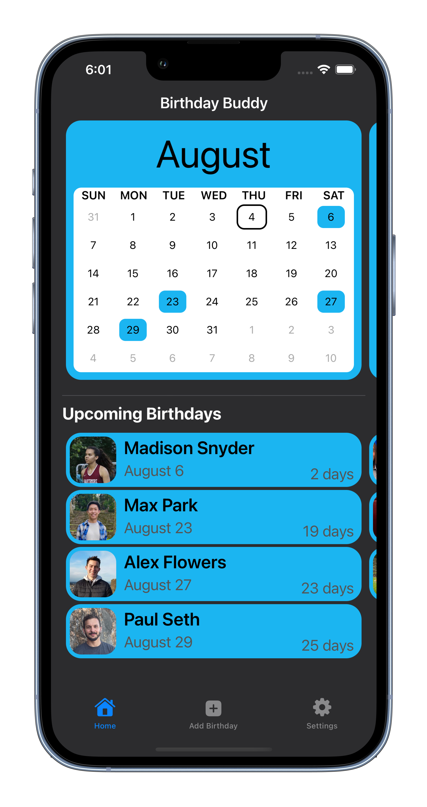
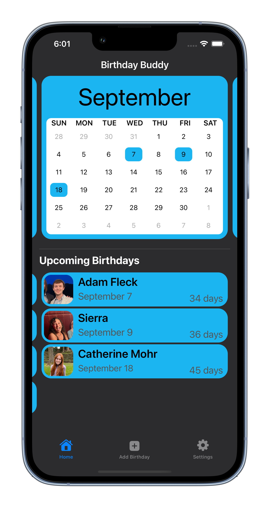
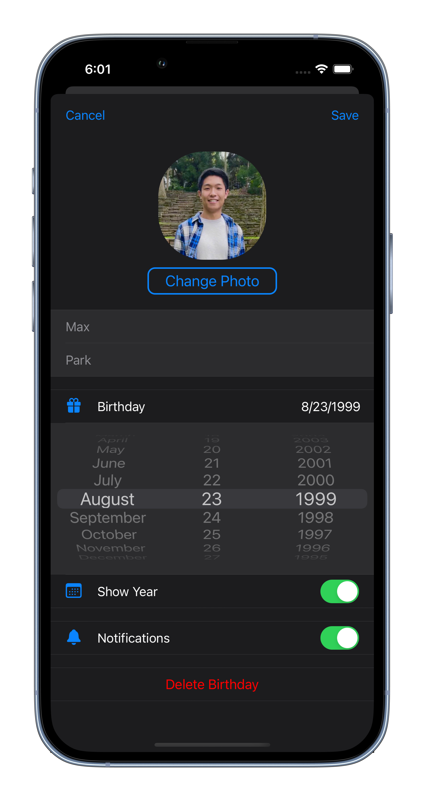

# BirthdayBuddy

### Screen Shots

  
  

  
  

---

### Table of Contents

- [Description](#description)
- [How To Use](#how-to-use)
- [Author Info](#author-info)

---

## Description

- A simple reminder app for birthdays

- Each birthday can have an associated profile picture

- Alerts user when today is a birthday by using User Notifications

- Project was completed using 100% programmatic UI (No Storyboard)

- MVC design pattern

#### Frameworks

- UIKit
- Firebase Database and User Authentication (Google, Facebook, Apple, Email)
- UserNotifications
- NotificationCenter

---

### What I Learned:
- How to make a custom Date Picker and Calendar
- Collection Views with Compositional Layouts
- When to use notifications/observers vs. delegates/protocols
- Setting up autolayout to work with all iPhone devices
- How to manage disk and network usage with Firebase
- Switching from a CoreData model to Firebase
---

## How To Use

- Clone the project and run it on Xcode 13 or above
- Will soon upload to TestFlight and then App Store
---

## Author Info

- Twitter - [@_maxpark](https://twitter.com/_maxpark)
- Website - [LinkedIn: Max Park](https://www.linkedin.com/in/itsmaxpark/)

[Back To The Top](#BirthdayBuddy)
